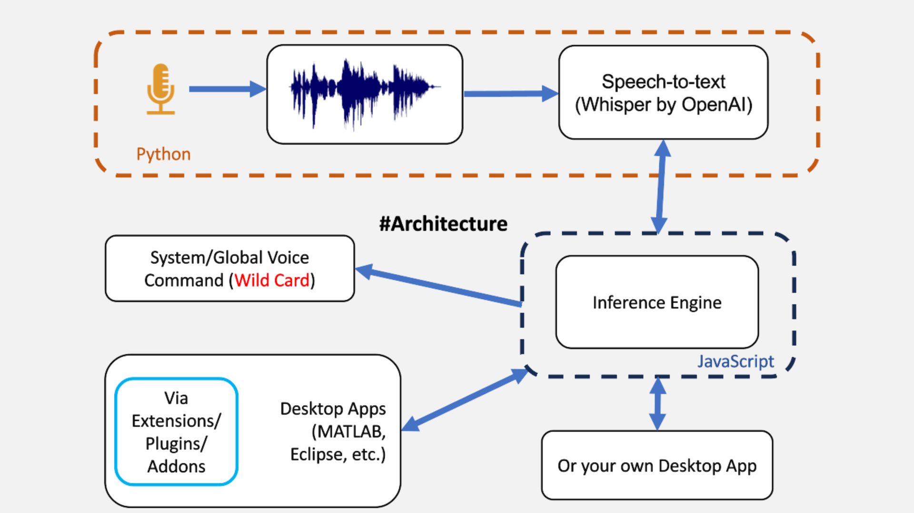

<div align="left">

# Shared Voice Interface #
This project provides system-wide **shared** Speech to Text Engine to:  
1. Add voice commands to any Desktop App (via Extension/Addon/Plugin ex.[Code](https://github.com/UmangRajpara13/Code) or integrate into your own app like [TalkGPT](https://github.com/UmangRajpara13/TalkGPT)).  
2. Run your Automation scripts/command-line commands with personalized voice commands(uses a JSON file to link voice commands to programmatic execution).

</div >


#### [Watch Demo](https://youtu.be/WQbUCbn8PN0)


## Built-In Features ##

RealTime transcription - starts recording when a speaker says something, stops recording if speaker stops speaking for 0.5sec.  

Google Anything - start by saying google followed by 'your_search_query' (ex: Google what's the weather outside?)

## Architecture ##

<p align="center">
  <a aria-label="Arrow logo" href="">
    
  </a>
</p>  

## Software Environment ##

  python 3.9.9  
  Nodejs 18.9  
  OS: Linux (very likely it will work on OSX without any tweaks. On Windows bash scripts(in ./universal-commands/scripts and anywhere in src) will have to converted into batch scripts)  

## Hardware Config used during Development and Execution ##

System Ram : 8Gb (2x4Gb) [Recommended > 16Gb]  
Graphic card : Nvidia Graphics MX350(Pascal Architecture, CUDA capability 6.1, VRAM 2GB)  
Microphone : External Bluetooth Headeset with Microphone Arm (Recommended). Avoid using in-built microphone of your laptop.  


## Installation ##


    git clone git@github.com:UmangRajpara13/able.git
    cd ./able/listen
    python3 -m venv venv
    source "venv/bin/activate"
    pip install -r requirements.txt
    deactivate
    cd ..
    npm install

The project uses [Whisper](https://github.com/openai/whisper) by OpenAI which requires the command-line tool [`ffmpeg`](https://ffmpeg.org/) to be installed on your system, which is available from most package managers:

```bash
# on Ubuntu or Debian
sudo apt update && sudo apt install ffmpeg

# on Arch Linux
sudo pacman -S ffmpeg

# on MacOS using Homebrew (https://brew.sh/)
brew install ffmpeg

# on Windows using Chocolatey (https://chocolatey.org/)
choco install ffmpeg

# on Windows using Scoop (https://scoop.sh/)
scoop install ffmpeg
```

## Run ##   


#### In 1st Terminal window  

    npm run engine

#### and in 2nd Terminal window.

    npm run listen


Avoid using in-built microphone of your laptop, External headset with Microphone is recommended

