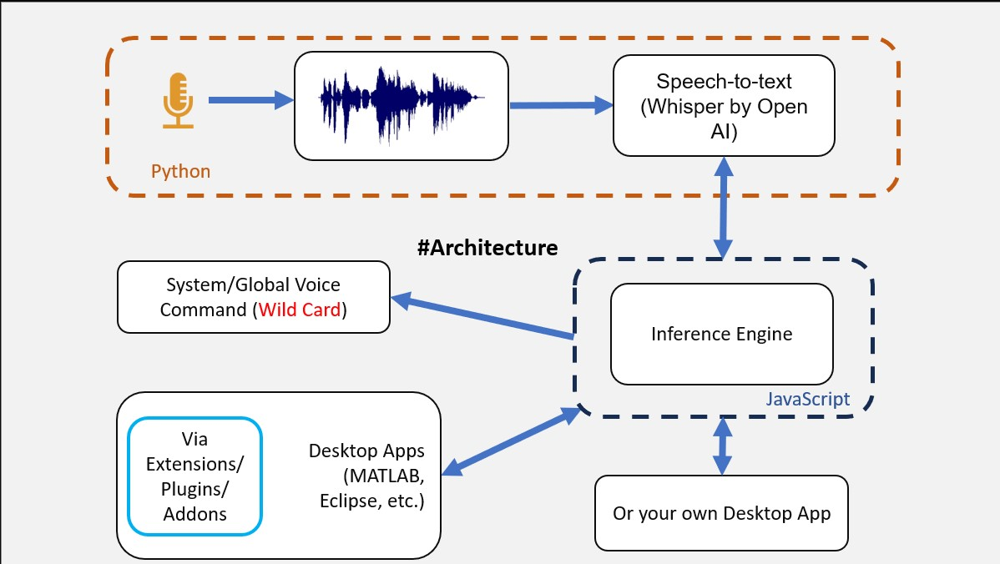

<div align="left">

# Voice Interface for Computers #
Add voice commands to any Desktop Apps with system-wide shared Speech to Text Engine.​
</div >

## Software Environment ##

  python 3.9.9  
  Nodejs 18.9  
  OS: Linux (very likely it will work on OSX without any tweaks. On Windows bash scripts(in ./universal-commands/scripts and anywhere in src) will have to converted into batch scripts)  

## Hardware Config used during Development and Execution ##

System Ram : 8Gb (2x4Gb) [Recommended > 16Gb]  
Graphic card : Nvidia Graphics MX350(Pascal Architecture, CUDA capability 6.1, VRAM 2GB)  
Microphone : External Bluetooth Headeset with Microphone Arm (Recommended). Avoid using in-built microphone of your laptop.  

The project uses [Whisper](https://github.com/openai/whisper) by OpenAI which requires the command-line tool [`ffmpeg`](https://ffmpeg.org/) to be installed on your system, which is available from most package managers:


```bash
# on Ubuntu or Debian
sudo apt update && sudo apt install ffmpeg

# on Arch Linux
sudo pacman -S ffmpeg

# on MacOS using Homebrew (https://brew.sh/)
brew install ffmpeg

# on Windows using Chocolatey (https://chocolatey.org/)
choco install ffmpeg

# on Windows using Scoop (https://scoop.sh/)
scoop install ffmpeg
```


## Installation ##

    git clone git@github.com:UmangRajpara13/able.git
    cd ./able/listen
    python3 -m venv venv
    source "venv/bin/activate"
    pip install -r requirements.txt
    deactivate
    cd ..
    npm install

## Run ##   


#### In 1st Terminal window  

    npm run engine

#### and in 2nd Terminal window.

    npm run listen


Avoid using in-built microphone of your laptop, External headset with Microphone is recommended

## Intergrate Voice Support in your Extensions/Apps (Beta)

The documentaion is under development. In the meantime, please refer to source code of this [Extension](https://github.com/thevoyagingstar/code-able) for VS Code


## Architecture ##


<p align="center">
  <a aria-label="Arrow logo" href="">
    
  </a>
</p>  

## Milestones ##

- Develop an C++ addon for Python part of this project.
Hence, it will eventually become an Electron App.

- Add support for realocation of speech-to-text service for other uses cases (as requested by other apps) besides microphone service.   
